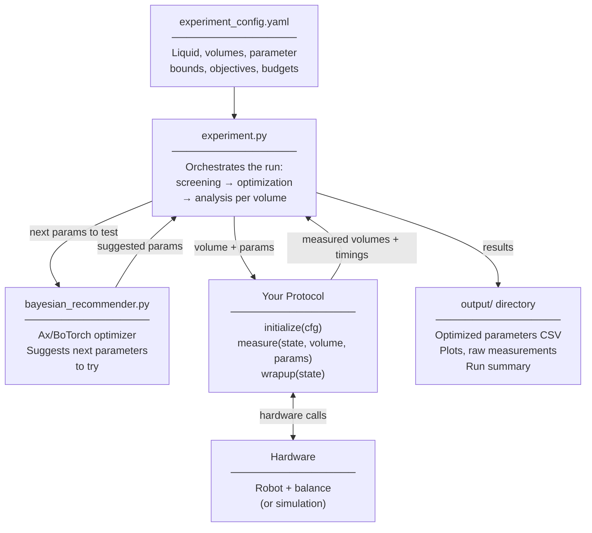

<p align="center">
  
</p>

# DispenseRITE: Automated Pipetting Calibration for Self-Driving Labs

Different liquids pipette differently. Viscous liquids, volatile solvents, and
surfactant-containing solutions all behave differently from water — and even the
same liquid behaves differently at different volumes. The result is systematic
pipetting error that is hard to correct by hand, and different for different systems.

**DispenseRITE** automatically calibrates pipetting parameters for a specific
liquid class using multi-objective Bayesian optimization. You tell it what
liquid you are pipetting, what volumes you care about, and how to measure
delivered volume. It then searches over your hardware's parameter space (speeds,
wait times, air gaps, blowout, overaspirate volume) and returns a per-volume
recipe optimized for accuracy, precision, and time. The result is a CSV of
calibrated parameters you can load and use directly in your pipetting protocols.

The decision layer is **purely software** — no specific robot or balance is
required. You plug in a protocol module that implements four functions
(`initialize`, `measure`, `wrapup`, `get_parameter_constraints`) and the
optimizer takes it from there. A simulated protocol is bundled so you can run
the entire pipeline end-to-end with no hardware at all.

The standard measurement approach is **gravimetric** — dispense onto a balance
and convert mass to volume using the liquid's density. Any measurement method
that returns a delivered volume works, including fluorescence, imaging, or
conductivity, as long as your protocol translates it into a volume in mL.

## Architecture



> **Swap hardware** by changing one line in the config (`hardware_protocol`).
> The optimizer and analysis pipeline are unchanged.

## Features

- **Hardware Abstraction** — swap protocols by editing one line of YAML
- **Bayesian Optimization** — multi-objective search via the Ax platform (qNEHVI, GPEI)
- **Adaptive Measurements** — optional extra replicates on noisy trials
- **Volume-Dependent Parameters** — re-optimize per target volume with transfer learning
- **Type-Safe Configuration** — YAML with strict schema validation
- **External Data Bootstrapping** — seed the optimizer from prior experiments (optional)
- **LLM-Guided Screening** — experimental AI-assisted parameter suggestions

## Quick Start

### 1. Install

Requires **Python 3.10 or later**.

```bash
cd sdl_pipette_calibration
pip install -r requirements.txt
```

### 2. Run a simulated calibration

Edit `experiment_config.yaml` and set:

```yaml
experiment:
  simulate: true
```

Then:

```bash
python run_calibration.py
```

Results land in `output/<run_name>/` — CSV summaries, optimized-parameter
files, and plots. No hardware needed.

### 3. Validate the optimized parameters

Point `validation.optimal_conditions_file` at the CSV the calibration produced,
then:

```bash
python run_validation.py
```

## Example Workflow

1. **Start with simulation** — set `experiment.simulate: true`, run `python run_calibration.py`
2. **Inspect outputs** — look at `output/<run_name>/` for plots and CSVs
3. **Adjust parameter bounds** — tune `hardware_parameters` for your setup
4. **Write your protocol** — copy `protocols/calibration_protocol_template.py`
5. **Run on hardware** — set `experiment.simulate: false`, run `python run_calibration.py`
6. **Validate** — point `validation.optimal_conditions_file` at the run's CSV, run `python run_validation.py`

The optimizer handles replication, transfer learning between volumes, and
produces analysis outputs (plots, feature importance, statistical summaries)
automatically.

## Understanding and Using the Outputs

Each calibration run creates a timestamped folder under `output/`. The key file
is **`optimal_conditions.csv`** — this is the end product of calibration.

### Output files

| File | What it contains |
|------|------------------|
| `optimal_conditions.csv` | **The calibration result.** One row per target volume with the best parameter set found and its achieved accuracy, precision, and timing. Copy this to `optimized_parameters/` to keep it. |
| `optimal_conditions.json` | Same data as the CSV, in JSON format |
| `trial_results.csv` | Every parameter combination tried during the run with its measured outcomes — useful for understanding the search |
| `raw_measurements.csv` | Individual replicate measurements for every trial |
| `analysis_report.txt` | Human-readable summary of the best results per volume |
| `experiment_summary.json` | Full run metadata (config, timings, counts) |
| `experiment_config_used.yaml` | Snapshot of the exact config used — useful for reproducing the run |

### Reading the optimal conditions

The `optimal_conditions.csv` has one row per calibrated volume. Key columns:

```
volume_target_ml   — target volume
deviation_pct      — achieved accuracy (lower is better)
precision_cv_pct   — achieved precision as CV% (lower is better)
duration_s         — average time per pipetting operation
status             — "success" or "failed" against your tolerances
calibration_overaspirate_vol  — the key correction volume
hardware_parameters_*         — one column per tuned hardware parameter
```

### Using the calibrated parameters in your protocols

`pipetting_wizard.py` provides a ready-to-use loader that reads an
`optimal_conditions.csv` and returns the right parameters for any target volume,
interpolating between calibrated points if needed:

```python
from pipetting_wizard import PipettingWizard

wizard = PipettingWizard(search_directory="optimized_parameters/")
params = wizard.get_parameters_for_volume(target_volume_ml=0.05, liquid="water")
# params is a dict of {parameter_name: value} ready to pass to your hardware
```

### Validating the calibration

Before using calibrated parameters in production, validate them with an
independent set of measurements:

```bash
# Point at the optimal_conditions.csv from your calibration run
python run_validation.py
```

Configure the validation target in `experiment_config.yaml`:

```yaml
validation:
  optimal_conditions_file: optimized_parameters/optimal_conditions_water.csv
  replicates_per_volume: 5
```

## Customizing Your Setup

All behavior is controlled by [`experiment_config.yaml`](experiment_config.yaml).
The file is organized into commented sections: `experiment`,
`calibration_parameters`, `hardware_parameters`, `optimization`, `output`,
`validation`, `screening`, `tolerances`, `adaptive_measurement`. Skim it once
— the inline comments explain each block.

### Basic experiment settings

```yaml
experiment:
  liquid: water                                    # label, propagated to outputs
  volume_targets_ml: [0.005, 0.01, 0.025, 0.05]    # volumes to calibrate
  simulate: true                                    # false = run on real hardware
  hardware_protocol: calibration_protocol_myrobot   # your protocol (used when simulate: false)
  simulation_protocol: calibration_protocol_simulated
  name: my_calibration_run
  description: Testing accuracy across four volumes
  random_seed: 30
  max_total_measurements: 96  # See "Measurement budget" below
  num_screening_trials: 8
```

#### Measurement budget

Every trial consumes physical resources — tips, liquid, and time. The
`max_total_measurements` setting caps the total number of individual pipetting
measurements across the entire run. This matters because:

- **Tips are finite** — a tip rack typically holds 96 tips; once they are gone the run must stop
- **Slow hardware** — if each measurement takes 30–60 seconds, 96 measurements is already a 1–3 hour run
- **Multiple volumes** — the budget is shared across all volumes in `volume_targets_ml`; calibrating 4 volumes with 96 measurements means roughly 24 measurements per volume

A typical starting point is **96 measurements** (one full tip rack). Increase
it if you have more tips available and want the optimizer to search more
thoroughly; decrease it for quick exploratory runs.

### Hardware parameter search space

Each entry in `hardware_parameters` defines one dimension of the search:

```yaml
hardware_parameters:
  aspirate_speed:
    bounds: [2, 30]
    default: 10
    type: integer
    round_to_nearest: 1
    description: Aspiration speed (relative units).

  aspirate_wait_time:
    bounds: [0.0, 30.0]
    default: 10.0
    type: float
    round_to_nearest: 0.1
    description: Wait time after aspiration (seconds).
```

### Pinning parameters (skip optimization without deleting them)

Any parameter listed under `experiment.fixed_parameters` is held at the given
value and excluded from the search space, while its `hardware_parameters`
block (bounds/default/description) stays intact. Toggle a parameter in or out
of the optimizer by adding or removing its entry in `fixed_parameters` —
no need to rewrite the parameter definition.

```yaml
experiment:
  fixed_parameters:
    post_asp_air_vol: 0        # held constant; not tuned
    retract_speed: 5.0         # held constant; not tuned
```

### Optimization settings

```yaml
optimization:
  objectives:
    # weights must sum to 1.0
    accuracy_weight: 0.4
    precision_weight: 0.5
    time_weight: 0.1

  optimizer:
    type: multi_objective       # or single_objective
    backend: qNEHVI             # first-stage screening backend
    backend_subsequent: GPEI    # backend for subsequent volumes
```

### Writing your own protocol

Copy the template and fill in the TODO sections:

```bash
cp protocols/calibration_protocol_template.py protocols/calibration_protocol_myrobot.py
```

See `protocols/calibration_protocol_template.py` for a minimal, annotated
example showing exactly what to implement.

Then point the config at it:

```yaml
experiment:
  hardware_protocol: calibration_protocol_myrobot   # filename without .py
  simulation_protocol: calibration_protocol_simulated
  simulate: false
```

## Protocol Interface Requirements

Your protocol **must** implement these four methods:

### `initialize(cfg) -> Dict[str, Any]`
- Initialize hardware
- Return a **state dictionary** — a plain dict of whatever your hardware needs to track
  across the calibration run (robot handles, vial positions, measurement counters, etc.)
- State is passed unchanged to every `measure()` and `wrapup()` call; the framework never inspects its contents
- See `protocols/calibration_protocol_template.py` for suggested keys and examples

### `measure(state, volume_mL, params, replicates) -> List[Dict[str, Any]]`
- Perform pipetting measurements
- `params` is a dict of parameter values chosen by the optimizer — keys match exactly the names defined in `hardware_parameters` in the config (e.g. `aspirate_speed` in config → `params.get('aspirate_speed', 10)` in your protocol)
- `overaspirate_vol` is always present in `params` and must be used to increase the aspirated volume
- Return list of measurement dictionaries, one per replicate
- Each result must have: `replicate`, `volume` (measured in mL), `elapsed_s`
- Echo `**params` into each result dict so the optimizer can log what parameter values were tested

### `wrapup(state) -> None`
- Clean up hardware resources
- Move to safe positions, close connections, etc.

### `get_parameter_constraints(target_volume_ml) -> List[str]`
- Return hardware-specific optimization constraints
- Called for each target volume during optimization
- Return empty list `[]` if no constraints apply

## Measurement Result Format

Each measurement result must include:

```python
{
    'replicate': 1,                    # Replicate number (1-based)
    'volume': 0.0089,                  # Measured volume in mL
    'elapsed_s': 3.2,                  # Time taken in seconds
    'target_volume_mL': 0.01,          # Target volume
    # Plus any parameters you want to echo back
    'my_hardware_param': 15.5,         # Your hardware-specific parameter
    'my_timing_param': 2.0,            # Your hardware-specific timing
    # etc.
}
```

## Advanced Features

### Hardware Constraints
Define hardware-specific parameter relationships in your protocol file:

```python
def get_parameter_constraints(self, target_volume_ml: float) -> List[str]:
    """Return constraint strings for the optimizer."""
    constraints = []
    
    # Example: Tip volume constraint
    tip_volume_ml = 1.0  # Your tip capacity
    available_volume = tip_volume_ml - target_volume_ml
    constraints.append(f"my_air_param + overaspirate_vol <= {available_volume}")
    
    # Example: Hardware limits
    constraints.append("my_speed1 * my_speed2 <= 1000")
    
    return constraints
```

### External Data Integration
Load existing calibration data to bootstrap the optimizer — this replaces the
initial screening phase with real historical results instead of random trials,
so the optimizer starts from a better position.

The CSV must contain these columns:
- `target_volume_ml` — the target volume for each measurement
- `measured_volume_ml` — the actual measured volume
- `measurement_time_s` — how long the measurement took
- One column per hardware parameter you want to seed (names must match your `hardware_parameters` config keys exactly)

See `input_data/external_calibration_data.csv` for a complete working example.

```yaml
screening:
  external_data:
    enabled: true
    data_path: "input_data/external_calibration_data.csv"
    volume_filter_ml: 0.05   # Only use rows matching this target volume (optional)
    liquid_filter: water     # Only use rows matching this liquid type (optional)
```

### LLM-Powered Parameter Suggestions *(experimental)*
The system can use a large language model to suggest promising parameter
combinations during the screening phase, in addition to or instead of random
exploration. In practice, the current calibration data and parameter
descriptions are sent to the LLM as a prompt; the response is parsed for
concrete parameter values which are then run as screening trials.

The implementation uses [LM Studio](https://lmstudio.ai/) as a local model
server with an OpenAI-compatible API endpoint, so no external API key or cloud
service is required — the model runs on your own machine.

> **Note:** This feature is experimental. Results depend heavily on the model
> and prompt template used. The Bayesian optimizer will still run regardless of
> LLM suggestion quality.

```yaml
optimization:
  llm_optimization:
    enabled: true
    config_path: "llm_recommender/calibration_screening_llm_template.json"

screening:
  use_llm_suggestions: true
  llm_config_path: "llm_recommender/calibration_screening_llm_template.json"
```

### Adaptive Measurements
Control when additional replicates are performed:

```yaml
adaptive_measurement:
  enabled: true
  base_replicates: 1                  # baseline replicate count per trial
  deviation_threshold_pct: 100.0      # trigger extra replicates if deviation > this
  penalty_variability_pct: 100.0      # trigger extra replicates if variability > this
```

Extra replicates are drawn adaptively (capped by
`experiment.max_replicates_per_trial`) when a trial's deviation or variability
exceeds either threshold.

## Directory Structure

```
sdl_pipette_calibration/
├── run_calibration.py                   # Main entry point
├── run_validation.py                    # Validation entry point
├── experiment_config.yaml               # Configuration file
├── experiment.py                        # Experiment orchestration
├── config_manager.py                    # Configuration loading & validation
├── data_structures.py                   # Type-safe data classes
├── optimization_structures.py           # Optimization objective definitions
├── bayesian_recommender.py              # Ax/BoTorch optimization engine
├── analysis.py                          # Per-trial statistical analysis
├── experiment_analysis.py               # Post-hoc analysis (feature importance, etc.)
├── visualization.py                     # Plot generation
├── csv_export.py                        # Results export
├── external_data.py                     # External data loader
├── protocol_loader.py                   # Protocol discovery
├── constraint_calibration.py            # Two-point overaspirate calibration
├── pipetting_wizard.py                  # Load & interpolate calibrated parameters
├── yaml_io.py                           # Round-trip YAML writes (preserves comments)
├── input_data/                          # Sample / external datasets
├── protocols/                           # Hardware protocol modules
│   ├── calibration_protocol_base.py     # Abstract base class
│   ├── calibration_protocol_template.py # Start here for new hardware
│   ├── calibration_protocol_simulated.py# Simulation (no hardware needed)
│   └── calibration_protocol_northrobot.py, ...  # Reference implementations
├── llm_recommender/                     # Optional LLM-guided screening
├── tools/                               # Demo GUI and dashboards (not required)
└── output/                              # Run outputs — results and plots (gitignored)
```

## Troubleshooting

### Common Issues

**Import Errors**: Make sure `requirements.txt` is installed and you're in the right directory.

**Protocol Not Found**: Check that your protocol file is in `sdl_pipette_calibration/protocols/` and the name in config matches the filename.

**Configuration Errors**: The config is strictly validated. Check YAML syntax and required fields.

**Hardware Simulation**: If you want to test without hardware, set `experiment.simulate: true` in the config.

### Getting Help

1. Start from `protocols/calibration_protocol_template.py` — it has TODO comments for every required method
2. Look at `data_structures.py` for the expected types and fields
3. `experiment_config.yaml` is fully annotated — it documents every option inline

## Authors

Owen A. Melville, Enrui Lin, Ilya Yakakets, Yimu Zhao 

Acceleration Consortium, University of Toronto

DispenseRITE was developed at the intersection of self-driving lab research and hardware automation.
